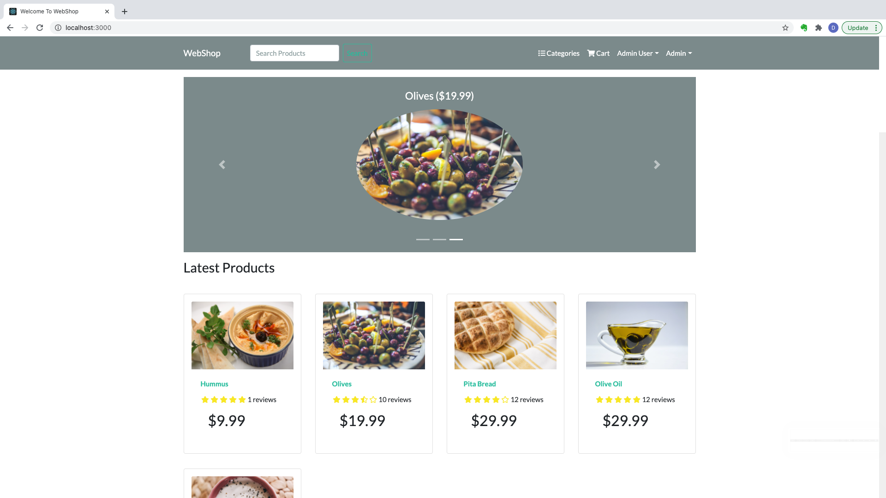

<!-- PROJECT LOGO -->
<br />
<p align="center">
  <a href="https://github.com/dnatsis/webshop">
    
  </a>

  <h3 align="center">Webshop</h3>

  <p align="center">
    A Full Stack ECommerce application built using the MERN Stack, Bootstrap and Redux
    <br />
    <a href="https://github.com/dnatsis/webshop"><strong>Explore the docs »</strong></a>
    <br />
    <br />
    <a href="https://github.com/dnatsis/webshop">View Demo</a>
    ·
    <a href="https://github.com/dnatsis/webshop/issues">Report Bug</a>
    ·
  </p>
</p>

<!-- TABLE OF CONTENTS -->
<details open="open">
  <summary><h2 style="display: inline-block">Table of Contents</h2></summary>
  <ol>
    <li>
      <a href="#about-the-project">About The Project</a>
      <ul>
        <li><a href="#built-with">Built With</a></li>
      </ul>
    </li>
    <li>
      <a href="#getting-started">Getting Started</a>
      <ul>
        <li><a href="#prerequisites">Prerequisites</a></li>
        <li><a href="#installation">Installation</a></li>
      </ul>
    </li>
    <li><a href="#usage">Usage</a></li>
    <li><a href="#roadmap">Roadmap</a></li>
    <li><a href="#license">License</a></li>
    <li><a href="#contact">Contact</a></li>
    <li><a href="#acknowledgements">Acknowledgements</a></li>
  </ol>
</details>

<!-- ABOUT THE PROJECT -->

## About The Project



A full stack ECommerce application built using the MERN Stack. The home page displays the latests Products,
as well as a product carousel with the top rated Products. The Home page also has a search box for searching through all the available products.

### Built With

- [React]()
- [NodeJS]()
- [MongoDB Atlas]()
- [Bootstrap]()
- [Redux]()

<!-- GETTING STARTED -->

## Getting Started

Coming soon...

### Prerequisites

Section coming soon...

- npm
  ```sh
  npm install npm@latest -g
  ```

### Installation

1. Clone the repo
   ```sh
   git clone https://github.com/dnatsis/webshop.git
   ```
2. Install NPM packages
   ```sh
   npm install
   ```

<!-- USAGE EXAMPLES -->

## Usage

Section coming soon....

<!-- ROADMAP -->

## Roadmap

See the [open issues](https://github.com/dnatsis/webshop/issues) for a list of proposed features (and known issues).

<!-- LICENSE -->

## License

Distributed under the MIT License. See `LICENSE` for more information.

<!-- CONTACT -->

## Contact

Dhimitris Natsis - [dnatsis](dnatsis@worcester.edu)

Project Link: [https://github.com/dnatsis/webshop](https://github.com/dnatsis/webshop)

<!-- ACKNOWLEDGEMENTS -->

## Acknowledgements

- []()
- []()
- []()
